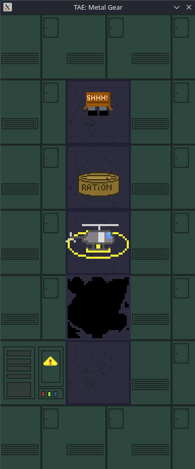
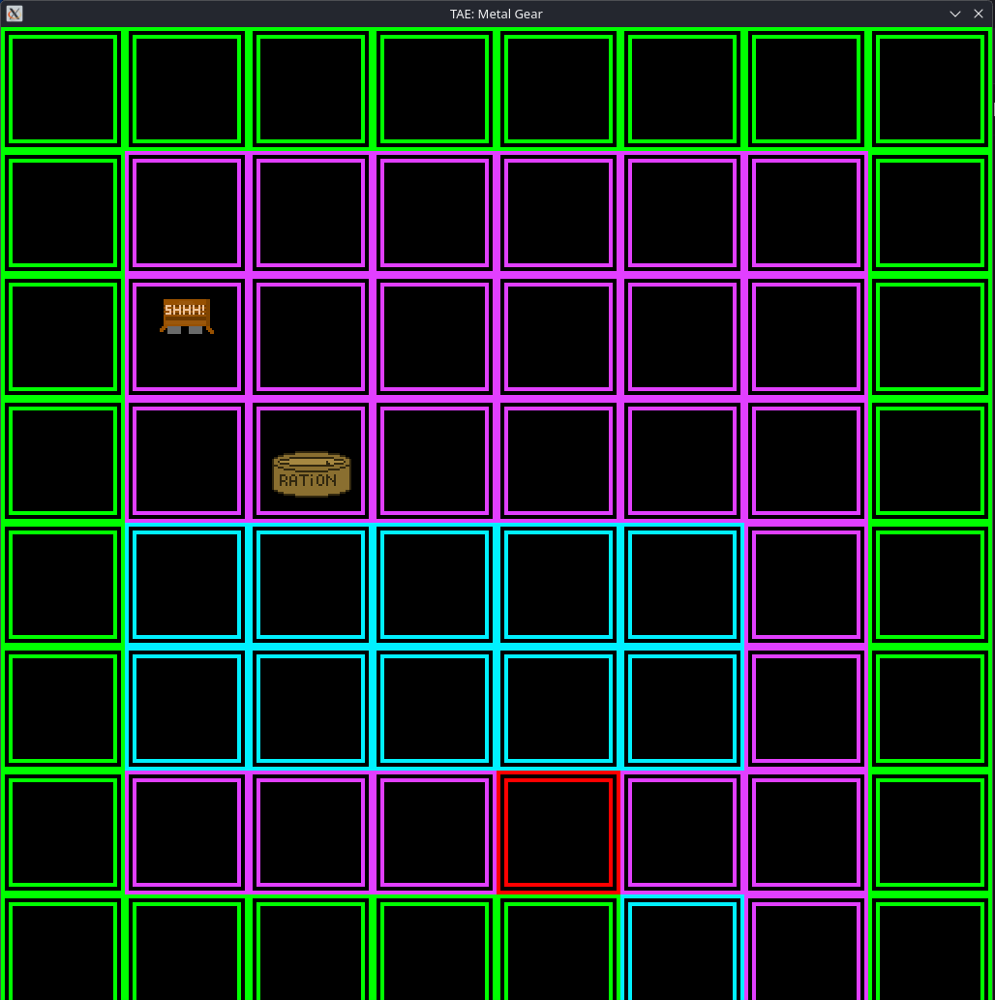

# So_Long

**First graphic project at 42**, inspired by the classic franchise  
*Tactical Espionage Action: Metal Gear Solid* by Hideo Kojima.

So_Long is a **top-down, grid-based game** where the player must collect all rations and reach the helipad to win. Each run features **randomized map sprites** thanks to a built-in RNG, making every playthrough slightly different.



---

## How to Play

- Lauch the game using
```bash
./so_long path/to/map.ber
```
- Move the player using the keyboard (arrow keys or WASD).  
- Press <Esc> to exit the game.
- Collect all **rations** on the map.  
- Once all rations are collected, reach the **helipad** to win.

---

## Custom Maps (`.ber` files)

The game supports **custom maps** provided by the player.

Maps are simple **text files** with a `.ber` extension and follow a grid-based format.

### Map Symbols

| Symbol | Meaning |
|--------|--------|
| `0`    | Empty space |
| `1`    | Wall / obstacle |
| `P`    | Player spawn point |
| `E`    | Exit (helipad) |
| `C`    | Collectible (ration) |

### Example Map
111111
1101P1
1101C1
1101E1
111111
111111

### Map Rules (Normal Mode)

A valid map must:

- Be **rectangular**  
- Contain **exactly one player** (`P`)  
- Contain **exactly one exit** (`E`)  
- Contain **at least one collectible** (`C`)  
- Be enclosed by walls  
- Be solvable (all collectibles and the exit must be reachable)  

If any of these rules are broken, the game will refuse to start.

##Map Logic
During game initialization, the provided map data is transformed before rendering.

Using a PRNG (Pseudo-Random Number Generator), the original map characters are replaced with randomly selected, predefined symbols. Each symbol corresponds to a specific wall asset located in the assets folder.

This approach allows the same map layout to produce varied visual results while preserving the underlying structure and gameplay logic.

To see the changes made to the map use the Debug Mode explained below.

---

###  Debug Mode

The game can be launched in **debug mode**, which relaxes some validation rules.



To enter debug mode simply run it as so:
```bash
./so_long maps/custom.ber debug_mode=y 
```

In debug mode:

Some map constraints may be bypassed

The game will attempt to run even with invalid or incomplete maps

Press R during gameplay to dump game information to the terminal, including:

Current map layout

Player position

Collectible positions

Other internal debug info

Useful for testing, experimentation, and development

⚠️ Unexpected behavior may occur when using invalid maps in debug mode.

License
Source Code

The source code is licensed under the MIT License.
See the LICENSE
 file for details.

Game Assets

All game assets (graphics, sounds, maps, etc.) are All Rights Reserved.
See assets/LICENSE
 file for details.
